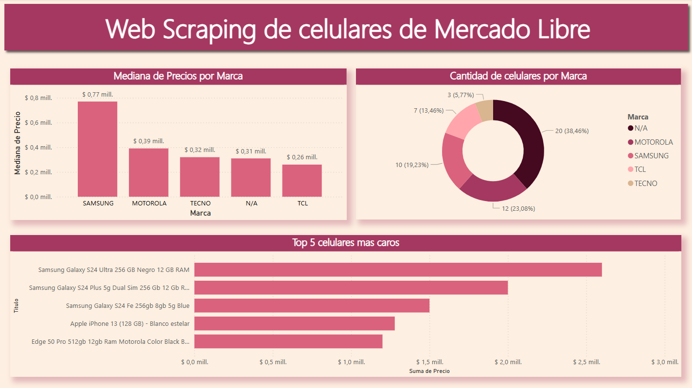

# Informe sobre celulares de MercadoLibre
Se llevó a cabo la recolección de datos de la página de Mercado Libre mediante la técnica de web scraping. La información recopilada corresponde a la primera página de resultados al buscar celulares de todas las gamas.

El análisis de los datos revela que los celulares más costosos son ofrecidos por la marca Samsung, seguida por Motorola, según los resultados de la primera página. Cabe destacar que algunas marcas no pudieron ser identificadas y aparecen representadas como "N/A".

